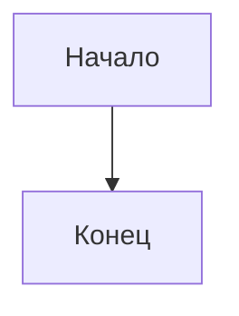

# 📄 MD → DOCX Converter

Веб-приложение для конвертации Markdown-файлов в Word (`.docx`) через Pandoc.  
Поддерживает GitHub-ссылки, загрузку файлов, Mermaid-диаграммы, изображения по URL и автоматическое исправление типичных ошибок форматирования.

[](https://md-to-word-26cmecsifrstgkvvarytjm.streamlit.app/)

---

## Возможности

- **Два способа подачи файла** — ссылка на GitHub или загрузка `.md` файла напрямую
- **Mermaid-диаграммы** — блоки ` ```mermaid ``` ` автоматически рендерятся в изображения
- **Изображения по URL** — скачиваются и встраиваются в документ
- **reference.docx** — поддержка кастомных стилей Word (`Heading 1`, `Caption`, `Source Code` и др.)
- **Автоисправление форматирования** — исправляет типичные ошибки перед конвертацией

### Что исправляет автоисправление

| Ошибка | Результат |
|--------|-----------|
| ` ``` ` без языка | → ` ```text ` |
| `#Заголовок` без пробела | → `# Заголовок` |
| `**1.1 Название**` вместо заголовка | → `## 1.1 Название` |
| `<b>`, `<i>`, `<br>` и другие HTML теги | → markdown-эквиваленты |
| Подпись к рисунку отдельным абзацем | → блок `custom-style="Caption"` |
| Нет пустой строки после заголовка | → добавляется |
| Таблица без подписи `Table:` | → `Table: Таблица N` |
| Голые URL без угловых скобок | → `<https://...>` |
| Нет пустой строки перед списком | → добавляется |

---

## Как использовать

1. Открыть [приложение](https://md-to-word-26cmecsifrstgkvvarytjm.streamlit.app/)
2. Выбрать источник — вкладка **«Ссылка на GitHub»** или **«Загрузить файл»**
3. При необходимости загрузить `reference.docx` для применения кастомных стилей Word
4. Нажать **«Конвертировать»**
5. Скачать готовый `.docx`

---

## Развернуть локально

### Требования

- Python 3.10+
- [Pandoc](https://pandoc.org/installing.html) — установить отдельно

### Установка и запуск

```bash
git clone https://github.com/mdobrynina/md-to-word.git
cd md-to-word
pip install -r requirements.txt
streamlit run app.py
```

Приложение откроется по адресу `http://localhost:8501`

---

## Развернуть на Streamlit Cloud (бесплатно)

1. Сделать форк этого репозитория
2. Зайти на [share.streamlit.io](https://share.streamlit.io) и войти через GitHub
3. Нажать **Create app** → выбрать репозиторий, branch `main`, файл `app.py`
4. Нажать **Deploy** — через ~2 минуты появится публичная ссылка

---

## Структура проекта

```text
md-to-word/
├── app.py              # Всё приложение (~200 строк)
├── requirements.txt    # Python-зависимости
└── packages.txt        # Системные пакеты (pandoc через apt)
```

---

## Технологии

| Компонент | Назначение |
|-----------|------------|
| Python 3 | Язык разработки |
| Streamlit | UI и бесплатный хостинг |
| Pandoc | Движок конвертации MD → DOCX |
| pypandoc | Python-обёртка над Pandoc |
| requests | Загрузка файлов по URL |
| mermaid.ink | Рендеринг Mermaid-диаграмм в PNG |

---

---

# Инструкция по написанию Markdown-файла для конвертации в DOCX через Pandoc

## 1. Заголовки

Используйте только стандартные заголовки Markdown — через `#`. Никогда не заменяйте заголовки жирным текстом.

Правильно:

```md
# Введение

## 1.1 Архитектура приложения

### 1.1.1 Серверная часть
```

Неправильно:

```md
**1.1 Архитектура приложения**
```

---

## 2. Абзацы

Каждый абзац отделяется пустой строкой. Переносы внутри абзаца без пустой строки Pandoc склеивает в один абзац.

```md
Первый абзац текста.

Второй абзац текста.
```

---

## 3. Списки

Маркированный список:

```md
- Первый пункт;
- Второй пункт;
- Третий пункт.
```

Нумерованный список:

```md
1. Первый пункт.
2. Второй пункт.
3. Третий пункт.
```

Важно: перед списком и после него оставляйте пустую строку.

---

## 4. Таблицы

Каждая таблица должна иметь подпись сверху через `Table:`.

```md
Table: Таблица 1 – Название таблицы

| Столбец 1 | Столбец 2 |
|-----------|-----------|
| Значение  | Значение  |
```

Без строки `Table:` Pandoc не применит стиль `Table Caption` к подписи.

---

## 5. Рисунки

Подпись к рисунку нельзя писать отдельным абзацем после картинки — Pandoc не распознает её как подпись и применит стиль обычного текста.

Неправильно:

```md


Рисунок 1 – Диаграмма
```

Правильно — подпись оборачивается в блок `:::` с указанием стиля:

```md


::: {custom-style="Caption"}
Рисунок 1 – Диаграмма
:::
```

Текст подписи не нужно дублировать внутри `` — оставьте скобки пустыми.

Изображения можно вставлять по прямой ссылке — приложение скачает их автоматически:

```md

```

---

## 6. Mermaid-диаграммы

Mermaid поддерживается — вставляйте код диаграммы напрямую в блок ` ```mermaid ``` `, приложение автоматически конвертирует его в изображение:

````md

````

---

## 7. Блоки кода

Используйте тройные обратные кавычки с указанием языка:

````md
```java
public class Main {
    public static void main(String[] args) {
    }
}
```
````

````md
```bash
git clone https://github.com/example/repo.git
```
````

````md
```sql
CREATE DATABASE mydb;
```
````

Для текста без подсветки используйте `text`:

````md
```text
Plantshop/
├── frontend/
└── backend/
```
````

---

## 8. Ссылки

URL оформляйте в угловых скобках — тогда Pandoc превратит их в кликабельные ссылки:

```md
Сайт: <https://open-meteo.com>
```

---

## 9. Стили, которые должны быть в reference.docx

Pandoc автоматически применяет следующие стили из reference.docx. Все они должны быть созданы и настроены заранее:

| Стиль в reference.docx | Для чего применяется |
|------------------------|----------------------|
| `Normal` | Основной текст |
| `Heading 1` | Заголовок `#` |
| `Heading 2` | Заголовок `##` |
| `Heading 3` | Заголовок `###` |
| `Caption` | Подписи к рисункам через `custom-style="Caption"` |
| `Table Caption` | Подписи к таблицам через `Table:` |
| `Verbatim Char` | Моноширинный текст внутри строки (backticks) |
| `Source Code` | Блоки кода (fenced code blocks) |

Если стиля нет в reference.docx — Pandoc использует встроенный стиль Word, который может отличаться от нужного.

---

## 10. Чего избегать

- Не используйте `**жирный текст**` вместо заголовков.
- Не пишите подпись к рисунку отдельным абзацем без `custom-style`.
- Не используйте HTML-теги внутри Markdown — они могут не конвертироваться корректно.
- Не ставьте перенос строки внутри ячейки таблицы.
